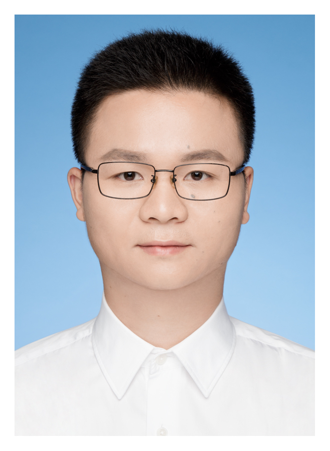

---

layout: default 
---

**Short Biography:** I am now a lecturer at the [College of Information Science and Technology](http://xxxy2016.jnu.edu.cn/), [Jinan University](https://www.jnu.edu.cn/). 

 I received the Ph.D. degree from the School of Informatics, Xiamen University in 2020, supervised by Prof. Shaozi Li. I was a visiting scholar at City University of Hong Kong, supervised by Kay Chen Tan.

**Email:** [jiazhang@jnu.edu.cn](mailto:jiazhang@jnu.edu.cn)

---

#### Research & Publications

My research interests include machine learning, data mining, and intelligent human-computer interactions. I have a few recent manuscripts available on-line: ( More Publications in [Google Scholar Link](https://scholar.google.com/citations?user=yBaTk-gAAAAJ&hl=en))

* <u>J. Zhang</u>, S. Li, M. Jiang, K. C. Tan. [Learning from weakly labeled data based on manifold regularized sparse model](09185009.pdf). **IEEE Transactions on Cybernetics**, in press. [[code](MSWL-master.zip)]
* Z.-A. Huang, <u>J. Zhang</u>, Z. Zhu, E. Q. Wu, K. C. Tan. [Identification of autistic risk candidate genes and toxic chemicals via multi-label learning](09177287.pdf). **IEEE Transactions on Neural Networks and Learning Systems**, in press.
* G. Du, <u>J. Zhang</u>, F. Ma, M. Zhao, Y. Lin, S. Li. Towards graph-based class-imbalance learning for hospital readmission. **Expert Systems with Applications**, 2021, 176: 114791.
* <u>J. Zhang</u>, Y. Lin, M. Jiang, S. Li, Y. Tang, K. C. Tan. [Multi-label feature selection via global relevance and redundancy optimization](0348.pdf). **In Proceedings of the 29th International Joint Conference on Artificial Intelligence (IJCAI’20)**, Yokohama, Japan, 2020, pp. 2512–2518. [[code](GRRO-master.zip)] [[report](v15.pptx)] [[poster](poster.pdf)]
* <u>J. Zhang</u>, Z. Luo, C. Li, C. Zhou, S. Li. [Manifold regularized discriminative feature selection for multi-label learning](1-s2.0-S0031320319302341-main.pdf). **Pattern Recognition**, 2019, 95: 136-150. [[code](MDFS-master.zip)]
* <u>J. Zhang</u>, C. Li, Z. Sun, Z. Luo, C. Zhou, S. Li. [Towards a unified multi-source-based optimization framework for multi-label learning](1-s2.0-S1568494618307051-main.pdf). **Applied Soft Computing**, 2019, 76: 425-435.
* <u>J. Zhang</u>, C. Li, D. Cao, Y. Lin, S. Su, L. Dai, S. Li. [Multi-label learning with label-specific features by resolving label correlations](1-s2.0-S0950705118303472-main.pdf). **Knowledge-Based Systems**, 2018, 159: 148-157.
* <u>J. Zhang</u>, C. Li, Y. Lin, Y. Shao, S. Li. [Computational drug repositioning using collaborative filtering via multi-source fusion](1-s2.0-S0957417417303202-main.pdf). **Expert Systems with Applications**, 2017, 84: 281-289. 
* <u>J. Zhang</u>, Y. Lin, M. Lin, J. Liu. An effective collaborative filtering algorithm based on user preference clustering. **Applied Intelligence**, 2016, 45(2): 230--240.
* Y. Lin, Q. Hu, <u>J. Zhang</u>, X. Wu. Multi-label feature selection with streaming labels. **Information Sciences**, 2016, 372: 256-275.

---

#### Teaching Experience

* Principles of Artificial Intelligence (for undergraduate students), Fall, 2021

---

#### Professional Activities
* Journal Reviewer: [IEEE Transactions on Cybernetics](https://mc.manuscriptcentral.com/cyb-ieee), [IEEE Transactions on Neural Networks and Learning Systems](https://mc.manuscriptcentral.com/tnnls), [Pattern Recognition](https://www.journals.elsevier.com/pattern-recognition/), [Information Sciences](https://www.journals.elsevier.com/information-sciences), [Knowledge-Based Systems](https://www.journals.elsevier.com/knowledge-based-systems), [Applied Intelligence](https://www.editorialmanager.com/apin/Default.aspx)

* PC Member: The International Joint Conference on Neural Networks ([IJCNN 2021](https://www.ijcnn.org/))
